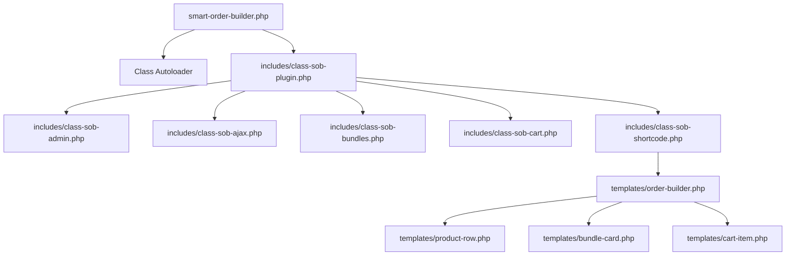

# WooCommerce Smart Order Builder — Developer Handoff Document

This document is the definitive guide and handoff resource for the **Smart Order Builder for WooCommerce** plugin. It is designed to allow any future developer or Antigravity AI agent to instantly understand the plugin's architecture, database schema, codebase, hook triggers, and styling standards, and continue development without friction.

---

## 📌 1. Project Overview & System Mission

The **Smart Order Builder** is a premium WooCommerce extension that replaces the standard WooCommerce product catalog page with a fast, high-conversion **two-column order builder interface**. 

### Core Layout:
1. **Left Column (70% width)**:
   - Category filtering & instant search (Name, SKU, or keywords via AJAX).
   - Product Grid/Table displaying thumbnails, product names, SKUs, short descriptions, prices, quantity selectors (`-` and `+`), and a Quick View eye icon.
   - **Smart Bundle Upgrade Banner**: Scans the customer's cart dynamically. If the cart has exactly $N-1$ items of an active bundle, it alerts the customer with a banner proposing to add the final missing item to form a bundle and save money.
   - **Recommended Bundles Grid**: Displays active bundle deals in a 2x2 grid showing included items, original vs. discounted prices, and total savings.
2. **Right Column (30% width - Sticky Sidebar)**:
   - **Order Summary**: Displays subtotal, tax, applied bundle discounts, and grand total in real-time.
   - **Interactive Cart**: Lists added products in the cart in place of cross-sells. Each item features its thumbnail image, name, line subtotal, and quantity adjusters (`-` and `+`). Decreasing any item to `0` removes it from both the sidebar and the main product table.
   - **Proceed to Checkout CTA**: Direct redirection to checkout.

### 🛡️ Engineering & Security Standards (AI-SEOS Compliance):
All code in this plugin strictly complies with the standards detailed in [WordPress_Plugin_Security_Handoff (1).md](file:///C:/Rishis%20Antigravity/WordPress_Plugin_Security_Handoff%20(1).md):
- **Zero-Trust Input Sanitization**: All inputs are sanitized using `sanitize_text_field()`, `absint()`, or `sanitize_title()`.
- **Late Output Escaping**: All output values are escaped at the point of print (e.g. `esc_html()`, `esc_attr()`, `esc_url()`, `wp_kses_post()`).
- **CSRF Protection via Nonces**: Every AJAX request is verified using `check_ajax_referer` with `sob_ajax_nonce`.
- **Authorization Checks**: Admin actions are guarded by checking user capabilities via `current_user_can( 'manage_woocommerce' )` or `current_user_can( 'edit_posts' )`.
- **WooCommerce HPOS Compatible**: Explicitly declares High-Performance Order Storage compatibility.

---

## 📁 2. Code Architecture & File Map

The plugin utilizes a custom autoloader mapping classes with the `SOB_` prefix to files located in `includes/class-sob-<filename>.php`.



### 🗃️ Complete File Map

| File Path | Description / Responsibility |
| :--- | :--- |
| [smart-order-builder.php](file:///C:/Rishis%20Antigravity/smart-order-builder/smart-order-builder.php) | Plugin entry bootstrap file. Performs WooCommerce dependency check, declares HPOS compatibility, and registers the class autoloader. |
| [uninstall.php](file:///C:/Rishis%20Antigravity/smart-order-builder/uninstall.php) | Clean uninstallation script. Completely deletes settings, transients, and all `sob_bundle` custom posts/metadata. |
| [includes/class-sob-plugin.php](file:///C:/Rishis%20Antigravity/smart-order-builder/includes/class-sob-plugin.php) | Singleton coordinator class. Defines constants, registers modules, and enqueues/localizes admin and frontend scripts and styles. |
| [includes/class-sob-admin.php](file:///C:/Rishis%20Antigravity/smart-order-builder/includes/class-sob-admin.php) | Handles the admin settings pages under WooCommerce. Renders tabs for General, Bundles, and Cross-sells settings, and manages input sanitization. |
| [includes/class-sob-ajax.php](file:///C:/Rishis%20Antigravity/smart-order-builder/includes/class-sob-ajax.php) | Handles all frontend AJAX requests (search, cart add/update/remove, product quick view drawer, bundle detail modal) and Select2 product searches for admin. |
| [includes/class-sob-bundles.php](file:///C:/Rishis%20Antigravity/smart-order-builder/includes/class-sob-bundles.php) | Registers the `sob_bundle` Custom Post Type. Handles admin metabox rendering, saving, and queries bundles from manual CPT, Grouped, or WC Product Bundles. |
| [includes/class-sob-cart.php](file:///C:/Rishis%20Antigravity/smart-order-builder/includes/class-sob-cart.php) | Core business logic engine. Manages cart overrides (filters visibility, thumbnails, subtotals, quantity adjusters), order integration, and coupon-less negative fee bundle discounts. |
| [includes/class-sob-shortcode.php](file:///C:/Rishis%20Antigravity/smart-order-builder/includes/class-sob-shortcode.php) | Registers the `[smart_order_builder]` shortcode, queries products, loads recommendations, and buffers template output. |
| [templates/order-builder.php](file:///C:/Rishis%20Antigravity/smart-order-builder/templates/order-builder.php) | Main structural template representing the two-column interface. |
| [templates/product-row.php](file:///C:/Rishis%20Antigravity/smart-order-builder/templates/product-row.php) | Renders a row for a single product inside the products list table. |
| [templates/bundle-card.php](file:///C:/Rishis%20Antigravity/smart-order-builder/templates/bundle-card.php) | Renders a single recommended bundle card showing original vs discounted prices. |
| [templates/bundle-modal.php](file:///C:/Rishis%20Antigravity/smart-order-builder/templates/bundle-modal.php) | Renders the detailed backdrop blurred modal explaining bundle content and details. |
| [templates/cart-item.php](file:///C:/Rishis%20Antigravity/smart-order-builder/templates/cart-item.php) | Renders a single cart item inside the right-hand sticky sidebar list. |
| [templates/cart-bundle-item.php](file:///C:/Rishis%20Antigravity/smart-order-builder/templates/cart-bundle-item.php) | Renders a grouped bundle package item inside the right-hand sticky sidebar list. |
| [templates/order-totals.php](file:///C:/Rishis%20Antigravity/smart-order-builder/templates/order-totals.php) | Renders the breakdown of subtotals, tax, bundle discounts, and grand totals. |
| [templates/quick-view-drawer.php](file:///C:/Rishis%20Antigravity/smart-order-builder/templates/quick-view-drawer.php) | Renders the off-canvas right-side quick view drawer for variation selection and product specs. |
| [templates/upgrade-banner.php](file:///C:/Rishis%20Antigravity/smart-order-builder/templates/upgrade-banner.php) | Renders the dynamic upgrade notification banner. |
| [templates/suggested-product.php](file:///C:/Rishis%20Antigravity/smart-order-builder/templates/suggested-product.php) | Renders suggested cross-sell product cards in the sidebar. |
| [assets/js/frontend.js](file:///C:/Rishis%20Antigravity/smart-order-builder/assets/js/frontend.js) | Orchestrates frontend interactivity. Listens to search inputs, handles quantity changes, handles variations, updates sidebars, and manages backdrop overlay scroll locking. |
| [assets/css/frontend.css](file:///C:/Rishis%20Antigravity/smart-order-builder/assets/css/frontend.css) | Premium styling system including column overlays, backdrop blur effects, sticky sidebar, scrollbars, and white-text column heading custom styling. |

---

## ⚙️ 3. Core Technical Implementations & Data Schema

### 3.1 Custom Post Type: Smart Bundles (`sob_bundle`)
- Registered under the WooCommerce admin menu parent path.
- **Fields & Metadata Schema**:
  - `post_title`: The name of the bundle (e.g., *Beach Getaway Pack*).
  - `thumbnail`: Featured image representing the bundle package card.
  - `_sob_bundle_products` (postmeta, `array`): Array of WooCommerce product IDs included in the bundle.
  - `_sob_bundle_product_quantities` (postmeta, `array`): Key-value array mapping `product_id => quantity` required for the bundle.
  - `_sob_bundle_price` (postmeta, `float`): Stored custom discounted price of the bundle package.
  - `_sob_bundle_priority` (postmeta, `int`): Stored priority for sorting display order in recommendation grids.

### 3.2 AJAX Verification & Communication
JavaScript utilizes localized parameters injected via `wp_localize_script()`:
```javascript
// Localized parameters map: window.sob_params
{
    ajax_url: "http://example.com/wp-admin/admin-ajax.php",
    ajax_nonce: "security_token_hash",
    currency_symbol: "$",
    checkout_url: "http://example.com/checkout/",
    i18n: { ... }
}
```
All frontend AJAX hooks require passing the `nonce` parameter and verifying it:
- **AJAX Nonce Action**: `sob_ajax_nonce`
- **Verification Helper**: `verify_security_token()` (in `SOB_Ajax`)

#### List of Frontend AJAX Actions:
- `sob_search_products`: Searches products using title/SKU, applies categories, and returns HTML rows with updated pagination status.
- `sob_add_to_cart`: Adds a simple product or variation to the WooCommerce cart.
- `sob_update_quantity`: Updates standard item quantity, or removes it if `qty` is set to `0`.
- `sob_remove_from_cart`: Removes an item completely from the cart.
- `sob_get_cart_summary`: Returns updated order summary JSON and templates.
- `sob_get_product_quick_view`: Renders the sliding drawer HTML.
- `sob_get_bundle_quick_view`: Renders the backdrop blurred modal HTML.
- `sob_add_bundle_to_cart`: Sets a unique group ID (`sob_bundle_group_id`) and adds all bundled items to the cart simultaneously.
- `sob_update_bundle_quantity`: Scales the quantity of all items in a bundle group proportionally or removes them.
- `sob_add_suggested_product`: Adds a cross-sell suggested item to the cart.

---

## 🧮 4. Pricing & Bundle Calculation Engines

The plugin applies discounts in two separate layers via the `woocommerce_cart_calculate_fees` action (in [includes/class-sob-cart.php](file:///C:/Rishis%20Antigravity/smart-order-builder/includes/class-sob-cart.php)):

### 4.1 Layer 1: Explicit Grouped Bundles
When a bundle is added from the frontend "Add Bundle" buttons, all individual items are tagged in the cart session with:
- `sob_bundle_id` (the ID of the CPT bundle)
- `sob_bundle_group_id` (a unique string prefix `sob_bg_` identifying this specific bundle instance)
- `sob_bundle_source` (how it was queried: `manual`, `grouped`, or `wc_bundles`)

The calculation engine sums up the items grouped under each `sob_bundle_group_id`. It determines the bundle quantity based on the first item's quantity ratio relative to its base bundle definition. It then calculates the total discount (original total of parts minus the bundle custom price) and applies it as a negative fee (e.g. `Bundle Discount: Ultimate Pack`).

### 4.2 Layer 2: Implicit Auto-Bundling (Greedy Algorithm)
If a user adds items individually, the plugin scans the cart for auto-matches:
1. Gathers all cart item quantities (excluding those already tagged with a `sob_bundle_group_id`).
2. Sorts all active bundles by **Savings (Descending)**.
3. Iterates through the sorted bundles. For each bundle, it checks if the cart contains the required quantities of the bundled items.
4. Determines the maximum number of full bundle sets formed.
5. Applies a negative fee: `Bundle Discount: Bundle Name (Auto-Match)`.
6. Deducts the matched quantities from the pool to prevent double-discounting before proceeding to the next bundle in the iteration.

---

## 🎨 5. Front-End Styling & UI Rules

- **Z-Index Hierarchy**:
  - Main Layout / Headers: Standard flow.
  - Quick View off-canvas Drawer: `z-index: 100000` (locks page scroll using `.sob-overflow-hidden` on `<body>`).
  - Bundle Detail Lightbox Modal: `z-index: 100001` (features center alignment, scrollable internal content, and backdrop blur).
- **Column Heading Styling**:
  - The first column header in `templates/order-builder.php` is styled as `Item` with custom white text.
- **Micro-Animations**:
  - Hover effects on product rows, category pills, buttons, and summary items using smooth CSS transitions (`transition: all 0.3s ease`).
  - Active spinner indicators overlays on product table search.

---

## 🚀 6. Developer Guidelines & Next Steps

If you are continuing work on this plugin, make sure to follow these procedures:

### ⚠️ Critical Constraints
- **Always use nonces** on every AJAX request.
- **Never use raw SQL** without `$wpdb->prepare()`.
- **Do not touch WooCommerce Core**. Implement changes strictly through filters or actions.
- **Ensure HPOS compatibility** is maintained in any class or DB method added.

### 📋 Recommended Next Tasks:
- [ ] **Dynamic Layout Settings**: Add settings in `SOB_Admin` to let users customize column widths (e.g., 60/40 vs 70/30) and table heading names directly from the WordPress dashboard.
- [ ] **Variable Product Bundling Support**: Enhance the admin `sob_bundle` edit screen to allow selection of specific variations instead of only parent product IDs.
- [ ] **AJAX Cart Fragments Integration**: Support standard WooCommerce cart fragments refresh if the order builder is displayed on a page alongside default sidebar widgets.
- [ ] **REST API Endpoints**: Migrate AJAX endpoints to custom WordPress REST API routes (`/wp-json/sob/v1/`) for improved performance and external integration.
